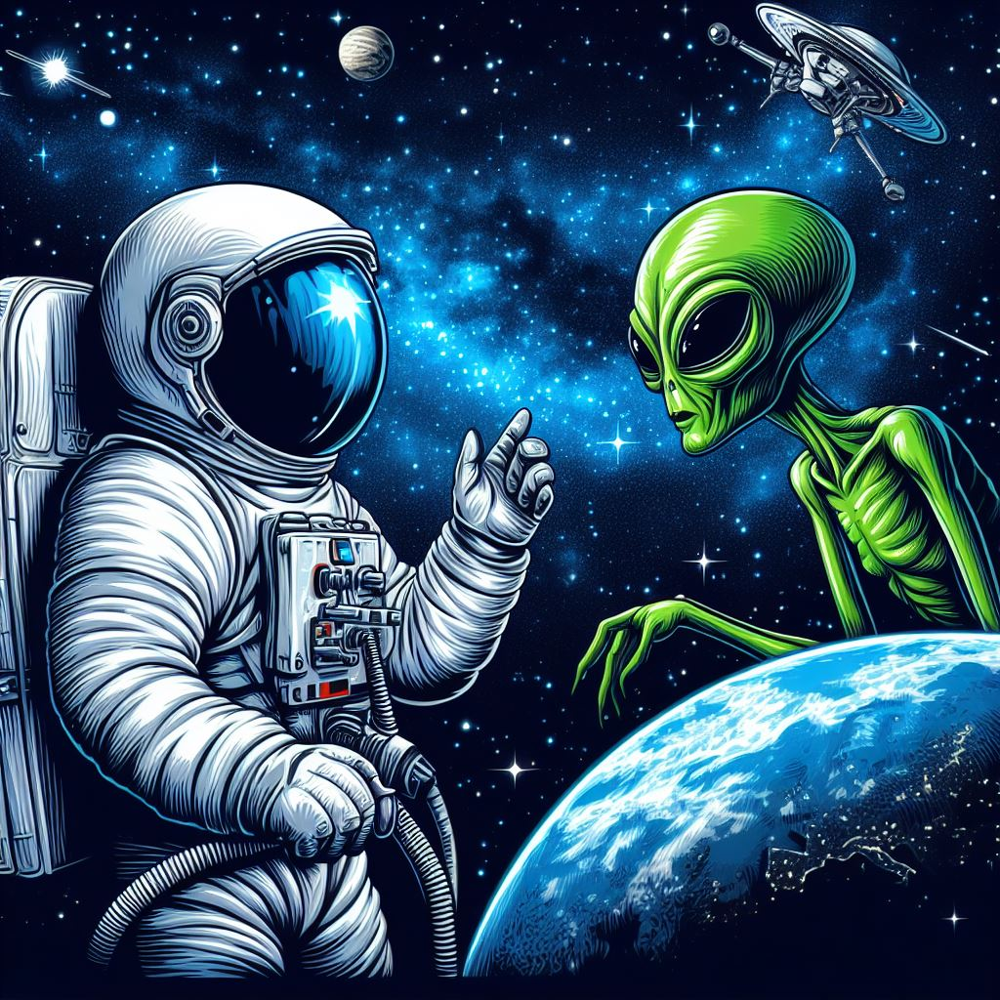

# Amistat Estel·lar: Una Història Entre un Astronauta i un Alien

    

## Introducció

Benvinguts a "Amistat Estel·lar", una història emocionant de dos éssers de mons diferents que es troben en l'espai i es converteixen en amics inseparables. Acompanya'ls en les seves aventures intergalàctiques plenes de misteri i descobriments sorprenents.

## Personatges Principals

### Capità Jordi Martínez

El Capità Jordi Martínez és un valent astronauta de la Terra, amb anys d'experiència en missions espacials. És conegut pel seu coratge i intel·ligència.

### Zorkel, l'Extraterrestre

Zorkel és un alien curiós i amable que viu en el planeta Glipthor. Té una pell de color verd llampant i uns ulls brillants que reflecteixen la seva intel·ligència.

## Resum de la Història

En una missió a l'espai profund, el Capità Martínez troba una nau alienígena a la deriva. En el seu interior, descobreix a Zorkel, qui ha quedat atrapat després d'un accident espacial. Després d'una breu desconfiança inicial, el Capità i Zorkel es fan amics i comencen a entendre-se malgrat les seves diferències culturals.

Junts, viuen emocionants aventures a través de galàxies desconegudes, resolent enigmes i ajudant a altres éssers extraterrestres en problemes. La seva amistat és una prova de que l'unió pot superar qualsevol obstacle, fins i tot quan provenim de mons diferents.

## Instal·lació

La història "Amistat Estel·lar" no requereix cap instal·lació especial. Simplement obre el fitxer de text i comença a llegir!

## Contribucions

Estem oberts a suggeriments i aportacions de la comunitat. Si tens idees per a nous capítols o personatges, no dubtis en compartir-les amb nosaltres!

## Agraïments

Agraïm a tots els lectors que segueixen les aventures del Capità Martínez i Zorkel. Esperem que gaudeixis d'aquesta història tant com nosaltres gaudim escrivint-la!

---

*Nota: Aquesta història és una obra de ficció i qualsevol semblança amb persones o fets reals és pura coincidència.*
